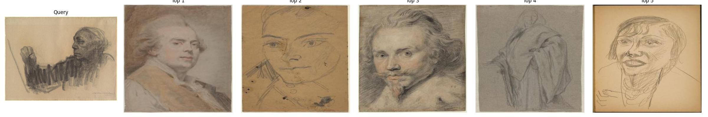
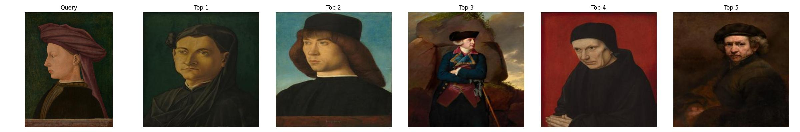
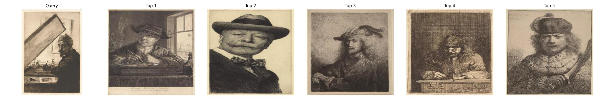

# Similarity
## Portrait Retrieval with FAISS + ViT

This project builds a **portrait similarity retrieval system** that combines:

- Visual features from **DINO Vision Transformer (ViT)**
- Fast approximate nearest neighbor search with **FAISS** (using IVF+PQ index structure)
- Weak labels (e.g. `"painting_001.jpg"`) to restrict search space by class

The system supports **query-by-example** similarity search on artworks from the **National Gallery of Art Open Access dataset**.

---

## Sample Results

> Below is an example output generated by `demo.ipynb`:

  

  

  

- Left: **Query Portrait**
- Right: **Top-5 Similar Results** retrieved from the same category (e.g., "painting")

---

## Method Overview

| Step | Description |
|------|-------------|
| **1. Preprocessing** | Download portrait artworks from NGA and assign **weak labels** from filenames (e.g. `painting_16.jpg`) |
| **2. Feature Extraction** | Use **DINO ViT** to extract visual embeddings (768-dim). |
| **3. PCA Reduction** | Apply PCA to reduce to 256-dim embeddings, improving **retrieval speed & efficiency** |
| **4. FAISS Indexing** | Build a FAISS **IVF+PQ index** or **Flat index** over reduced embeddings |
| **5. Class-Aware Retrieval** | Restrict query to **same class** using filename prefix and sub-index filtering |
| **6. Interactive Demo** | Visualize **query + top-K results** and save the output for reports or evaluation |

---
## Acknowledgements

- Dataset: [National Gallery of Art Open Data](https://github.com/NationalGalleryOfArt/opendata)

- FAISS: [Efficient similarity search from Facebook AI](https://github.com/facebookresearch/faiss.git)